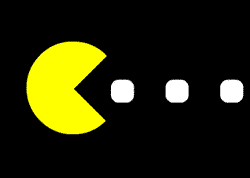

<h1 align="left"> Hi there 👋 , I'm Haoxiang. </h1>

   
   
   
   

<h3 align="left">  I am a fresh graduate of University of Missouri and majoring in Computer Science for a Master degree. </h3>

---

- 🔭 **I’m currently working on:** LeetCode and Job Seeking
- 🌱 **I’m currently learning:** Java Self-Learning
- 📫 **Graduate Date:** Dec 2022
- 🤔 **I’m looking for a job:** Software Developer Engineer
<!-- - ⚡ **Hobbies:** internet, music, series, fishing, body-building -->
- 😄 **Pronouns:** he/him

---

<!--- 

    Useful links
    https://shields.io/   # this is for buttons
    https://github.com/anuraghazra/github-readme-stats   # this is for status cards
--->

<!-- 
**zhanghx04/zhanghx04** is a ✨ _special_ ✨ repository because its `README.md` (this file) appears on your GitHub profile.
Here are some ideas to get you started:
- 🔭 I’m currently working on ...
- 🌱 I’m currently learning ...
- 👯 I’m looking to collaborate on ...
- 🤔 I’m looking for help with ...
- 💬 Ask me about ...
- 📫 How to reach me: ...
- 😄 Pronouns: ...
- ⚡ Fun fact: ...
-->
